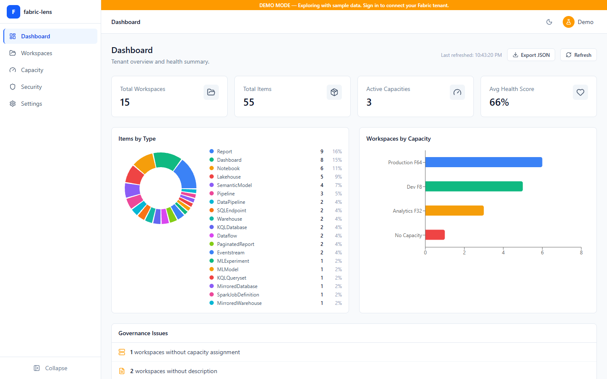
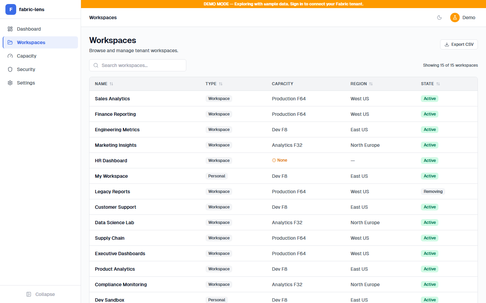
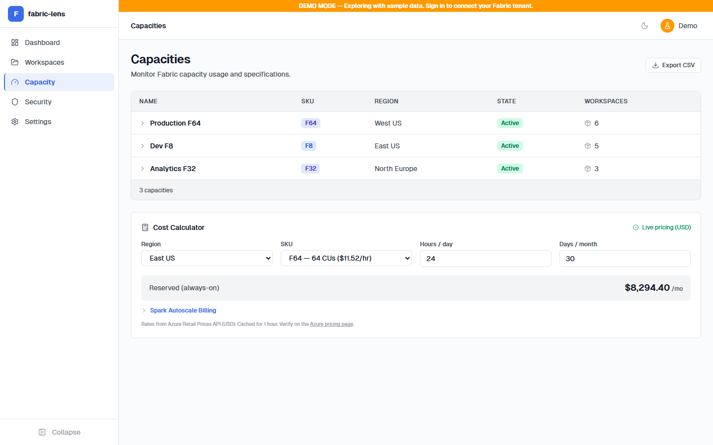
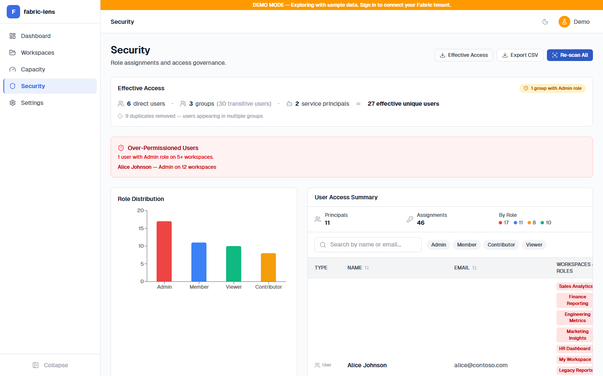
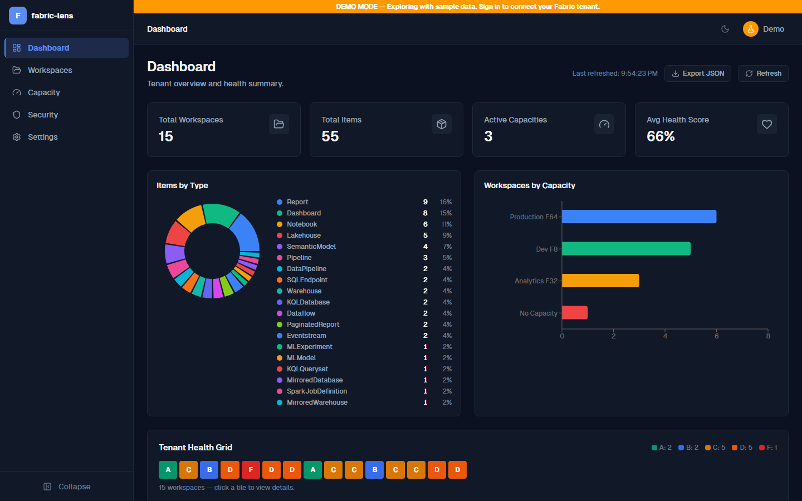

# Fabric Lens

**Open-source tenant governance & health intelligence for Microsoft Fabric.**

Fabric Lens is a standalone React SPA that connects directly to Microsoft Fabric REST APIs via MSAL.js authentication. No backend required — everything runs in your browser. Ships with a fully functional **demo mode** so you can explore immediately without an Azure tenant.

[](LICENSE)
[](tsconfig.app.json)
[](package.json)
[](https://lively-grass-0fa393e10.2.azurestaticapps.net)

> **[Live Demo](https://lively-grass-0fa393e10.2.azurestaticapps.net)** — Try it instantly in your browser with sample data, no setup required.

---

## Screenshots

| Dashboard | Workspaces |
|-----------|------------|
|  |  |

| Capacity Monitor | Security Audit |
|-----------------|----------------|
|  |  |

<details>
<summary>Dark Mode</summary>



</details>

---

## Features

| Feature | Description |
|---------|-------------|
| **Dashboard** | Tenant-wide overview with workspace/item/capacity stats, artifact distribution charts, governance issues, and average health score |
| **Workspace Explorer** | Browse, search, and drill into every workspace. View items, health grades, capacity assignments, OneLake endpoints, and Git status |
| **Health Scoring** | Automated 100-point governance assessment per workspace across 9 checks — description, capacity, domain, Git, naming, staleness, data layer, item count, and identity |
| **Capacity Monitor** | Track SKUs, regions, and states with tier-based badges. Cost calculator with **live Azure pricing** from the Azure Retail Prices API |
| **Security Audit** | Cross-workspace role mapping with search, role filter chips, sortable columns, and pagination. Flags over-permissioned users (Admin on 5+ workspaces) |
| **CSV Export** | Export workspace inventories and security audit data for offline analysis |
| **Dark Mode** | Full dark/light theme toggle |
| **Demo Mode** | Realistic mock data — 3 capacities, 15 workspaces, 54+ items, 6 users — no Azure credentials needed |

---

## Quick Start

```bash
# Clone and install
git clone https://github.com/psistla/fabric-lens.git
cd fabric-lens
npm install

# Start in demo mode (no configuration needed)
npm run dev
```

Open [http://localhost:5173](http://localhost:5173). The app launches in **demo mode** automatically with sample data.

---

## Connecting to a Live Fabric Tenant

### 1. Create an App Registration

1. Go to the [Azure Portal](https://portal.azure.com) > **Microsoft Entra ID** > **App registrations** > **New registration**
2. Name: `Fabric Lens` (or any name)
3. Supported account types: match your tenant strategy (single or multi-tenant)
4. Redirect URI: select **Single-page application (SPA)** and enter `http://localhost:5173`
5. Click **Register**

### 2. Configure API Permissions

In your App Registration > **API permissions** > **Add a permission**:

| API | Permission | Type |
|-----|-----------|------|
| Power BI Service | `Workspace.Read.All` | Delegated |
| Power BI Service | `Tenant.Read.All` | Delegated |
| Power BI Service | `Capacity.Read.All` | Delegated |
| Azure Service Management | `user_impersonation` | Delegated |

Click **Grant admin consent** (requires admin privileges).

### 3. Configure Environment

Create a `.env.local` file in the project root:

```env
VITE_MSAL_CLIENT_ID=<your-client-id>
VITE_MSAL_TENANT_ID=<your-tenant-id>
VITE_MSAL_REDIRECT_URI=http://localhost:5173
VITE_FABRIC_API_BASE=https://api.fabric.microsoft.com/v1
VITE_ARM_API_BASE=https://management.azure.com
```

### 4. Run with Live Data

```bash
npm run dev
```

Sign in with an Azure AD account that has access to your Fabric tenant. Users with the **Fabric Admin** role will see additional features (tenant-wide workspace listing, security audit).

---

## Architecture

```
┌──────────────────────────────────────────────────────────────┐
│                     Browser SPA (React 19)                   │
│                                                              │
│  ┌─────────────┐  ┌──────────────┐  ┌────────────────────┐  │
│  │ React Router │  │Zustand Stores│  │     MSAL.js 5      │  │
│  │              │  │              │  │                    │  │
│  │ /dashboard   │  │workspaceStore│  │ login() / logout() │  │
│  │ /workspaces  │◄►│capacityStore │  │ acquireTokenSilent │  │
│  │ /capacity    │  │securityStore │  │                    │  │
│  │ /security    │  │uiStore       │  └─────────┬──────────┘  │
│  │ /settings    │  └──────┬───────┘            │             │
│  └─────────────┘          │                    │             │
│                           ▼                    ▼             │
│                  ┌────────┴────────┐  ┌────────┴──────────┐  │
│                  │  fabricClient   │◄─│  Token injection   │  │
│                  └───┬────┬───┬───┘  └────────────────────┘  │
│                      │    │   │                               │
│  ┌───────────────────┼────┼───┼─────────────────────────┐    │
│  │   Demo Mode       │    │   │   (mock data layer)     │    │
│  │   isDemoMode ──►  │    │   │   3 capacities,         │    │
│  │   bypass auth     │    │   │   15 workspaces,        │    │
│  │   serve mocks     │    │   │   54+ items, 6 users    │    │
│  └───────────────────┼────┼───┼─────────────────────────┘    │
└──────────────────────┼────┼───┼──────────────────────────────┘
                       │    │   │
                       ▼    ▼   ▼
          ┌────────┐ ┌─────┐ ┌─────┐ ┌──────────────────┐
          │ Fabric │ │Admin│ │ ARM │ │ Azure Retail      │
          │Core API│ │ API │ │ API │ │ Prices API        │
          │        │ │     │ │     │ │ (public, no auth) │
          └────────┘ └─────┘ └─────┘ └──────────────────┘
```

**Key design decisions:**
- **No backend** — pure SPA with delegated permissions. Simplest deployment (static hosting), no server-side secrets
- **MSAL popup auth** — preserves app state, falls back to redirect if popups blocked
- **Live pricing** — Azure Retail Prices API (public, no auth) with 1-hour cache and graceful fallback

---

## Health Scoring

Each workspace is scored out of **100 points** across nine governance checks:

| Check | Points | Description |
|-------|--------|-------------|
| Has description | 10 | Workspace has a non-empty description |
| Assigned to capacity | 15 | Workspace is linked to a Fabric capacity |
| Assigned to domain | 10 | Workspace belongs to a defined domain |
| Git integration | 15 | Workspace is connected to a Git repository |
| Naming convention | 10 | Name follows the configured pattern |
| No stale items | 10 | All items modified within 90 days |
| Data layer present | 10 | Contains at least one Lakehouse or Warehouse |
| Reasonable item count | 10 | Fewer than 100 items |
| Workspace identity | 10 | Service principal identity configured |

**Grades:** A (90+) · B (80+) · C (65+) · D (50+) · F (<50)

---

## Project Structure

```
src/
  auth/           MSAL config, AuthProvider, useAuth, ProtectedRoute
  api/            fabricClient, resource modules, azurePricing, demo, types/
  data/           SKU specifications and derived pricing (skuSpecs.ts)
  store/          Zustand stores (workspace, capacity, security, ui)
  components/
    layout/       AppShell, Sidebar, Header
    workspace/    GovernanceIssues, HealthBadge, HealthDetail
    shared/       DataTable, StatCard, SearchBar, EmptyState, ExportButton, ...
    charts/       ItemsByTypeChart, WorkspacesByCapacityChart
  pages/          Dashboard, Workspaces, WorkspaceDetail, Capacity, Security, Settings
  utils/          healthScore, export (CSV), constants (single source of truth)
```

---

## Scripts

| Command | Description |
|---------|-------------|
| `npm run dev` | Dev server at `http://localhost:5173` |
| `npm run build` | `tsc -b && vite build` — strict TypeScript + production build |
| `npm run type-check` | `tsc --noEmit` — type checking only |
| `npm run lint` | ESLint |
| `npm run test` | Vitest (single run) |
| `npm run test:watch` | Vitest (watch mode) |

---

## Tech Stack

| | Technology |
|--|-----------|
| Framework | React 19 + TypeScript (strict) |
| Build | Vite 7 |
| Styling | Tailwind CSS v4 (`@tailwindcss/vite`) |
| UI Primitives | Radix UI + class-variance-authority + tailwind-merge |
| State | Zustand 5 |
| Charts | Recharts 3 |
| Auth | @azure/msal-browser 5 + @azure/msal-react 5 |
| Router | React Router v7 |
| Icons | lucide-react |
| Testing | Vitest + React Testing Library |

---

## Contributing

See [CONTRIBUTING.md](CONTRIBUTING.md) for development setup, coding standards, and the pull request process.

---

## ⭐ Star This Repo

If fabric-lens saves you time governing your Fabric tenant, consider starring the repo. It helps others discover the tool and keeps the project visible.

---

## 📄 License

MIT — use it, fork it, ship it.

---

## Built By

**Prasanth Sistla** — Senior Architect Consultant

[](https://www.linkedin.com/in/prasanthsistla/)

---

## Disclaimer

Fabric Lens is an independent, community-driven project. It is **not** affiliated with, endorsed by, or sponsored by Microsoft Corporation. "Microsoft Fabric" is a trademark of Microsoft Corporation.
