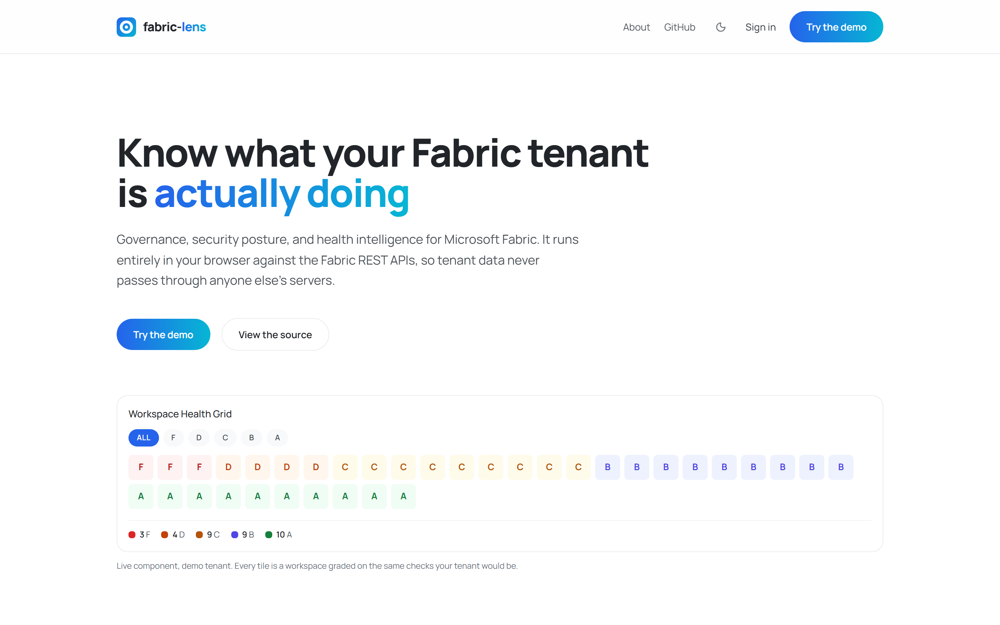
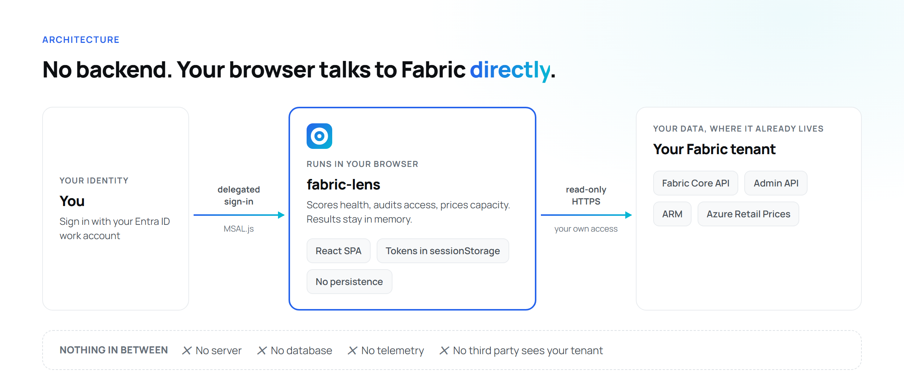
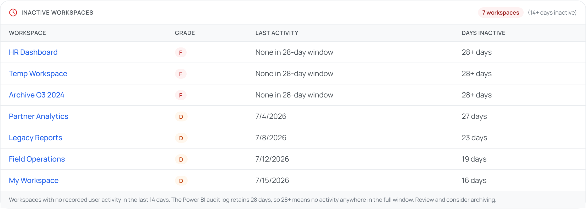

# fabric-lens

**No install, no backend, no data leaving your browser. Health scores, security findings, and capacity run rates for Microsoft Fabric.**

[](https://fabric-lens.com)

[](#your-tenant-data-never-leaves-your-browser)
[](#your-tenant-data-never-leaves-your-browser)
[](SECURITY.md)
[](LICENSE)

Point it at your tenant and it tells you which workspaces are ungoverned, who has more access than
they should, what your capacities cost, and which settings are quietly exposing data to the whole
organization.

Nothing to deploy. No capacity to provision. No pipeline to schedule. Sign in and you have answers
in about a minute, or **[try the live demo](https://fabric-lens.com)** with sample data and no
sign-in at all.



---

## Your tenant data never leaves your browser

This is the first question a governance tool should answer, so: fabric-lens is a static single-page
app with **no backend**. It calls the Microsoft Fabric REST APIs directly from your browser using
delegated permissions, over your own session. There is no server to send results to, because there
is no server.

<picture>
  <source media="(prefers-color-scheme: dark)" srcset="docs/architecture-dark.png">
  
</picture>

- **Read-only.** Every Fabric and Graph scope is a `*.Read.All` delegated permission, and the app
  issues no writes. The one exception in naming is Azure Service Management, where `user_impersonation`
  is the only delegated scope Azure offers; it is used solely for capacity read calls.
- **Nothing stored.** Tenant data lives in memory for the session and is never persisted or sent
  anywhere. The only things written to browser storage are your theme preference and the MSAL token
  cache, which uses `sessionStorage` so tokens die with the tab.
- **You see only what you can already see.** Delegated permissions mean the app inherits your
  access, not more.
- **Auditable.** The whole thing is MIT-licensed and in this repo. Read it, fork it, self-host it.

Details in [SECURITY.md](SECURITY.md).

---

## What it shows you

| | |
|--|--|
| **Tenant health at a glance** | A single tenant score, then the Health Grid: a dense tile map of every workspace's grade, worst first. Governance issues and a security summary follow; distribution charts sit behind a fold |
| **Workspace health scoring** | Every workspace scored across 9 governance checks (description, capacity, domain, workspace identity, naming, active items, data layer, item count, tag coverage) and graded A to F. [How scoring works](https://fabric-lens.com/about) |
| **Security posture** | A posture score and top findings lead, then drill-in areas for Access, Sharing, Settings, and Lifecycle. Flags over-permissioned users and expands Entra ID group membership via Microsoft Graph (opt-in) |
| **Exposure detection** | Widely shared reports and semantic models reachable by the entire organization, high-risk tenant settings (PublishToWeb, external sharing), and org-wide sharing that bypasses domain boundaries |
| **Ghost workspaces** | Workspaces with no recorded user activity in the last 28 days, the full retention window of the Power BI audit log |
| **Capacity and cost** | SKUs, regions, and states with a cost calculator driven by **live Azure retail pricing**, not hardcoded rates |
| **Item inventory** | 51 recognized Fabric item types across every workload, including the newest GA additions (Data Agents, Eventhouse, Digital Twin Builder). Unknown types flow through rather than breaking |
| **Governance report** | A printable multi-section report: executive summary, health distribution, security findings, tenant settings, exposure, inactive workspaces, and prioritized recommendations |
| **CSV export** | Workspace inventories and security audit data, for whatever you do next with them |

Dark mode throughout. Demo mode with a realistic 35-workspace tenant, so you can evaluate the whole
thing before asking anyone for consent.

| Dashboard | Security audit |
|-----------|----------------|
|  |  |

| Workspaces | Capacity monitor |
|------------|------------------|
|  |  |

Inactive workspaces, ranked by how long they have been quiet. `28+` means no recorded activity
anywhere in the audit log's full retention window, which is as far back as the data goes.



<details>
<summary>Dark mode</summary>


</details>

---

## Get started

### Use the hosted version

1. Go to [fabric-lens.com](https://fabric-lens.com)
2. Click **Sign in with Microsoft** and authenticate with your work account
3. Approve the one-time consent prompt (your tenant admin may need to grant it)

That's the whole setup. Core scopes are requested at sign-in; admin and Graph scopes are requested
only when you first open a feature that needs them, so you are never prompted for permissions you
don't use.

### Or run it yourself

```bash
git clone https://github.com/psistla/fabric-lens.git
cd fabric-lens
npm install
npm run dev
```

Open [http://localhost:5173](http://localhost:5173). With no configuration it starts in **demo
mode** against sample data. To point it at a real tenant, `cp .env.example .env.local` and fill in
your Entra ID app registration details.

<details>
<summary><b>Self-hosting: app registration and permissions</b></summary>

#### App registration

1. [Azure Portal](https://portal.azure.com) → **Microsoft Entra ID** → **App registrations** → **New registration**
2. Supported account types: match your tenant strategy (single or multi-tenant)
3. Redirect URI: choose **Single-page application (SPA)**, add `http://localhost:5173` and your production URL
4. **Register**

#### API permissions

**Core, requested at sign-in:**

| API | Permission | Type |
|-----|-----------|------|
| Microsoft Fabric | `Workspace.Read.All` | Delegated |
| Microsoft Fabric | `Item.Read.All` | Delegated |
| Microsoft Fabric | `Capacity.Read.All` | Delegated |
| Azure Service Management | `user_impersonation` | Delegated |

**Requested on demand, first visit to the Security page:**

| API | Permission | Type |
|-----|-----------|------|
| Microsoft Fabric | `Tenant.Read.All` | Delegated |

**Requested on demand, opt-in from Settings:**

| API | Permission | Type |
|-----|-----------|------|
| Microsoft Graph | `GroupMember.Read.All` | Delegated |

Then **Grant admin consent** (requires admin privileges). Do not add Power BI Service permissions;
that is a different service principal and it breaks admin consent in tenants without a Power BI
subscription.

#### Environment

| Variable | Description |
|----------|-------------|
| `VITE_MSAL_CLIENT_ID` | App registration client ID. Omit or set to `demo` for demo mode |
| `VITE_MSAL_TENANT_ID` | Your tenant ID, or `common` for multi-tenant |
| `VITE_MSAL_REDIRECT_URI` | Your deployment URL |

See [.env.example](.env.example) for the full set. On Azure Static Web Apps, set these as
Application Settings in the portal rather than shipping a `.env.local`.

</details>

---

## How it's built

React 19 and TypeScript in strict mode, built with Vite, deployed as static files. Routes split into
a public marketing shell (`/`, `/about`) and an authenticated app shell; state lives in one Zustand
store per domain; every Fabric call goes through a single client that handles token injection,
continuation-token pagination, and admin rate limits.

**Decisions worth knowing:**

- **No backend.** A pure SPA with delegated permissions. Static hosting, no server-side secrets, and
  nothing that could become a processor of your tenant's security findings.
- **Incremental consent.** Elevated scopes are acquired the first time a feature needs them, not up
  front, so the initial consent prompt stays small.
- **Multi-tenant.** MSAL authority set to `common`; any Entra ID tenant authenticates against a
  single app registration.
- **Live pricing.** The Azure Retail Prices API (public, no auth) with a 1-hour cache and a graceful
  fallback to derived rates.
- **Open item-type union.** Microsoft adds Fabric item types continuously, so unrecognized types
  render and count correctly instead of requiring a release.

| | |
|--|--|
| Framework | React 19 + TypeScript (strict) |
| Build | Vite 8 |
| Styling | Tailwind CSS v4 |
| State | Zustand 5 |
| Charts | Recharts 3 |
| Auth | MSAL browser 5 + msal-react 5 |
| Router | React Router v7 |
| Testing | Vitest + React Testing Library + Playwright |

---

## Contributing

See [CONTRIBUTING.md](CONTRIBUTING.md) for setup, coding standards, and the PR process.

Every change has to clear one gate before it merges, locally and in CI:

```bash
npm run verify   # lint → strict build (tsc -b) → unit tests + coverage floor → Playwright e2e
```

The e2e suite loads every route in demo mode and fails on any console error. Two conventions catch
most review comments before they happen: run `npm run build` rather than `type-check` (the strict
build catches unused locals and parameters), and put every threshold, color, and magic number in
`src/utils/constants.ts` instead of inlining it.

Commits need a `Signed-off-by` line, which `git commit -s` adds for you. That is the
[DCO](CONTRIBUTING.md#5-sign-off-your-commits-dco), not a CLA; there is no paperwork and you keep
the copyright to your own work.

<details>
<summary>All scripts</summary>

| Command | Description |
|---------|-------------|
| `npm run dev` | Dev server at `http://localhost:5173` |
| `npm run build` | `tsc -b && vite build` (strict) |
| `npm run build:demo` | Production build pinned to demo mode |
| `npm run preview` | Serve the production build locally |
| `npm run lint` | ESLint |
| `npm run type-check` | `tsc --noEmit` (looser than `build`) |
| `npm run test` | Vitest, single run |
| `npm run test:watch` | Vitest, watch mode |
| `npm run test:coverage` | Vitest with coverage, enforces the floor |
| `npm run test:e2e` | Playwright end-to-end suite |
| `npm run verify` | The full gate, in order |
| `npm run screenshots` | Regenerate the README screenshots |
| `npm run og-image` | Regenerate the social share image |
| `npm run diagram` | Regenerate the architecture diagram (light and dark) |

</details>

If fabric-lens saves you time governing your tenant, a star helps other people find it.

---

## License

MIT. Use it, fork it, ship it.

## Built by

**Prasanth Sistla** · Senior Architect Consultant

[](https://www.linkedin.com/in/prasanthsistla/)

---

fabric-lens is an independent, community-driven project. It is **not** affiliated with, endorsed by,
or sponsored by Microsoft Corporation. "Microsoft Fabric" is a trademark of Microsoft Corporation.
