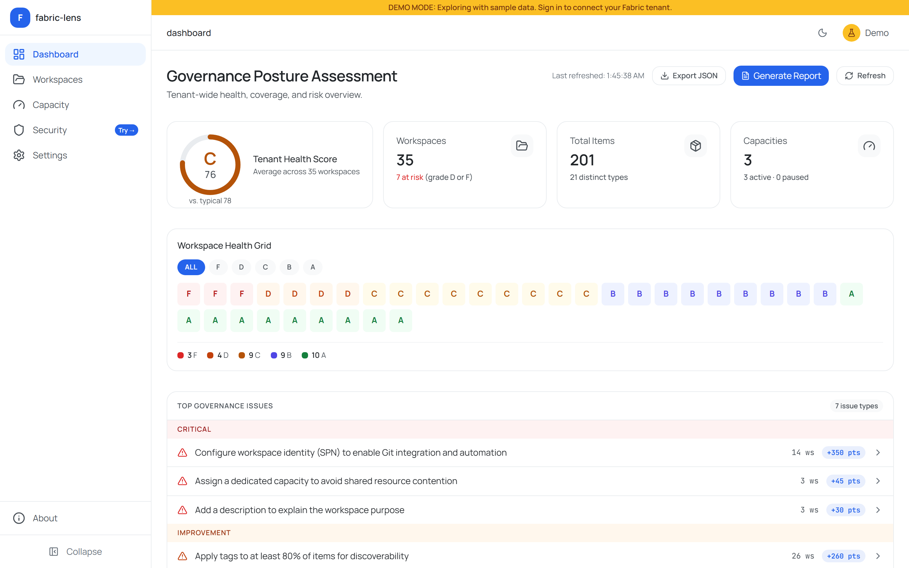
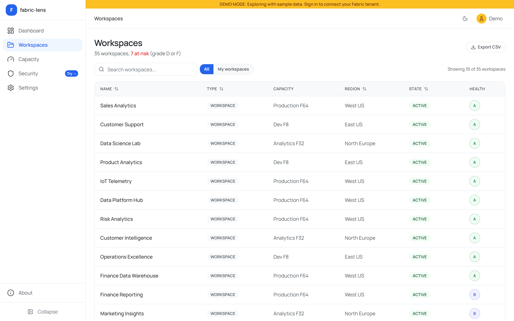
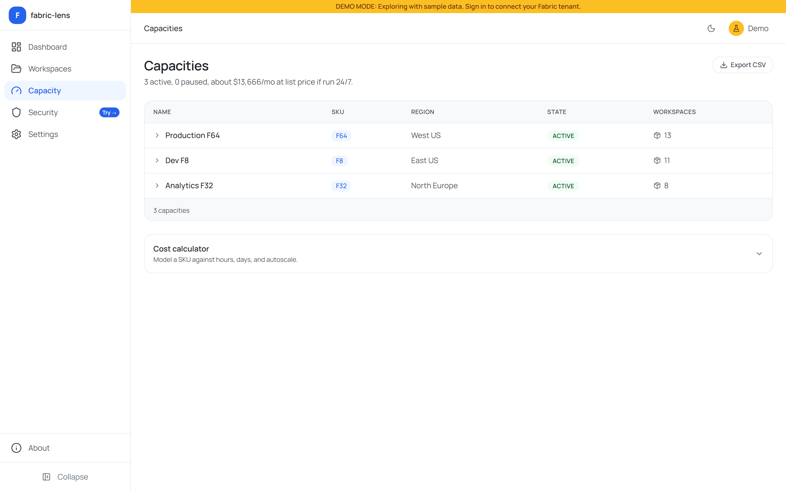
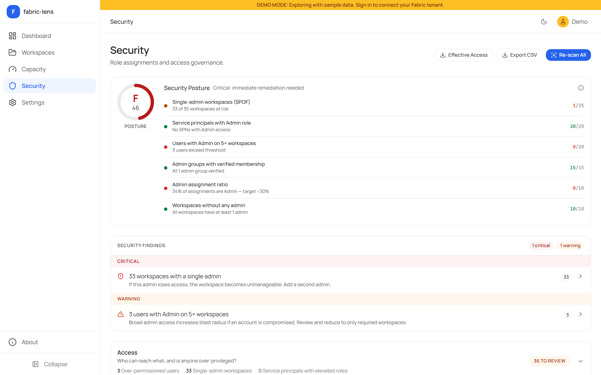
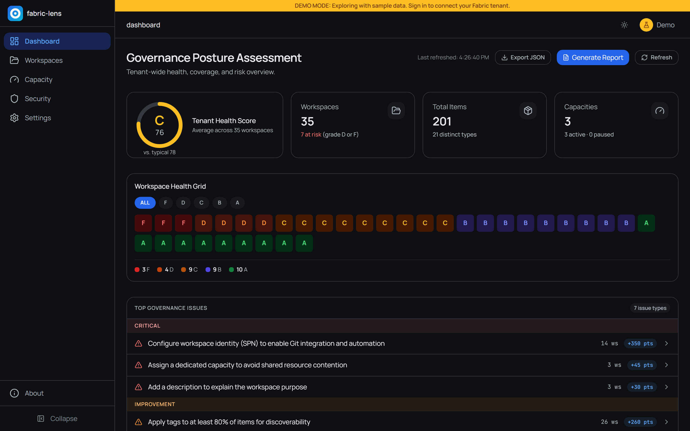
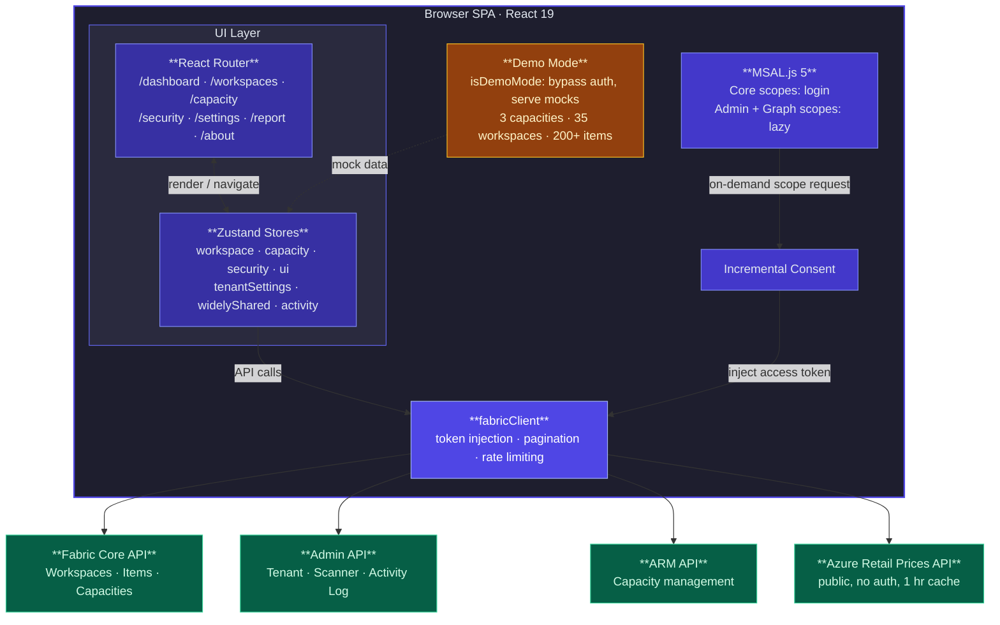

# Fabric Lens

**Open-source tenant governance & health intelligence for Microsoft Fabric.**

Fabric Lens is a standalone React SPA that connects directly to Microsoft Fabric REST APIs via MSAL.js authentication. No backend required; everything runs in your browser. Ships with a fully functional **demo mode** so you can explore immediately without an Azure tenant.

[](LICENSE)
[](tsconfig.app.json)
[](package.json)
[](https://fabric-lens.com)
[](SECURITY.md)

> **[Try the live demo](https://fabric-lens.com)** · Explore with sample data in your browser, no setup required.

---

## Screenshots

| Dashboard | Workspaces |
|-----------|------------|
|  |  |

| Capacity Monitor | Security Audit |
|-----------------|----------------|
|  |  |

<details>
<summary>Dark Mode</summary>



</details>

---

## Features

| Feature | Description |
|---------|-------------|
| **Dashboard** | Tenant-wide overview with workspace/item/capacity stats, artifact distribution charts, governance issues, average health score, and the **Health Grid**: a dense color-coded tile map showing every workspace's health grade at a glance, sorted best to worst |
| **Workspace Explorer** | Browse, search, and drill into every workspace. View items, health grades, capacity assignments, OneLake endpoints, and Git status |
| **Health Scoring** | Automated 100-point governance assessment per workspace across 9 checks: description, capacity, domain, Git, naming, active items, data layer, item count, and tag coverage |
| **Capacity Monitor** | Track SKUs, regions, and states with tier-based badges. Cost calculator with **live Azure pricing** from the Azure Retail Prices API |
| **Security Audit** | Cross-workspace role mapping with search, role filter chips, sortable columns, and pagination. Flags over-permissioned users (Admin on 5+ workspaces). Expands Azure AD group memberships via Microsoft Graph (optional) |
| **Tenant Settings Risk** | Surfaces enabled high-risk tenant-level settings (PublishToWeb, external sharing, etc.) with risk level badges. Requires Fabric Admin role |
| **Widely Shared Objects** | Identifies org-wide shared artifacts: reports and semantic models accessible to the entire organization via shareable links |
| **Inactive Workspace Detection** | Flags workspaces with no recorded activity in the past 7 days using the Power BI Activity Log API. Day-by-day API calls respect the same-day constraint |
| **Governance Report** | Printable multi-section report with executive summary, health distribution, security findings, tenant settings, widely shared objects, inactive workspaces, and top recommendations |
| **Incremental Consent** | Core API scopes are acquired at sign-in. Admin API (`Tenant.Read.All`) and Graph API (`GroupMember.Read.All`) scopes are requested on-demand the first time you use those features, so users are never prompted for permissions they don't need |
| **Multi-tenant** | Works with any Azure AD tenant. Sign in with your organization account; no per-tenant app registration required when using the hosted version |
| **CSV Export** | Export workspace inventories and security audit data for offline analysis |
| **Dark Mode** | Deep dark base (`#0D0F12`) with full semantic token support. Not pure black; creates depth without blue-navy tint |
| **Demo Mode** | Realistic mock data (3 capacities, 35 workspaces, 200+ items across all 19 item types, 8 users, 4 groups) with no Azure credentials needed |

---

## Getting Started

### Option 1: Use the hosted version (recommended)

The fastest way to connect your Fabric tenant. No installation, no configuration, no app registration required.

1. Visit [fabric-lens.com](https://fabric-lens.com)
2. Click **Sign in with Microsoft**
3. Authenticate with your Azure AD account
4. Your tenant admin approves the one-time consent prompt
5. Start exploring your governance posture

> **Note:** Your tenant admin may need to grant admin consent on first sign-in. Fabric Lens requests read-only access to workspace, item, and capacity data. Admin API and Microsoft Graph scopes are requested separately, only when you first use those features.

---

### Option 2: Self-host

For organizations that require self-hosted deployments or want to customize the tool.

```bash
git clone https://github.com/psistla/fabric-lens.git
cd fabric-lens
cp .env.example .env.local
# Edit .env.local with your Azure AD App Registration details
npm install
npm run dev
```

Open [http://localhost:5173](http://localhost:5173). Without any configuration, the app launches in **demo mode** automatically.

#### App Registration Setup

1. Go to [Azure Portal](https://portal.azure.com) > **Microsoft Entra ID** > **App registrations** > **New registration**
2. Name: `Fabric Lens` (or any name)
3. Supported account types: match your tenant strategy (single or multi-tenant)
4. Redirect URI: select **Single-page application (SPA)** and add both URIs:
   - `http://localhost:5173` (local development)
   - Your production URL (if deploying)
5. Click **Register**

#### API Permissions

In your App Registration > **API permissions** > **Add a permission**:

**Core (required on sign-in):**

| API | Permission | Type |
|-----|-----------|------|
| Microsoft Fabric | `Workspace.Read.All` | Delegated |
| Microsoft Fabric | `Item.Read.All` | Delegated |
| Microsoft Fabric | `Capacity.Read.All` | Delegated |
| Azure Service Management | `user_impersonation` | Delegated |

**Security Audit (requested on demand, first visit to Security page):**

| API | Permission | Type |
|-----|-----------|------|
| Microsoft Fabric | `Tenant.Read.All` | Delegated |

**Group Expansion (requested on demand, opt-in from Settings):**

| API | Permission | Type |
|-----|-----------|------|
| Microsoft Graph | `GroupMember.Read.All` | Delegated |

Click **Grant admin consent** for all permissions (requires admin privileges).

> **Incremental consent:** Fabric Lens only requests elevated permissions when you navigate to features that need them. Users are never prompted for scopes they don't use.

#### Environment Variables

Create `.env.local` in the project root:

| Variable | Description |
|----------|-------------|
| `VITE_MSAL_CLIENT_ID` | Your App Registration client ID |
| `VITE_MSAL_TENANT_ID` | Your Azure AD tenant ID (or `common` for multi-tenant) |
| `VITE_MSAL_REDIRECT_URI` | Your deployment URL (e.g. `http://localhost:5173`) |

Full example (copy from `.env.example`):

```env
VITE_MSAL_CLIENT_ID=<your-client-id>
VITE_MSAL_TENANT_ID=<your-tenant-id-or-common>
VITE_MSAL_REDIRECT_URI=http://localhost:5173
VITE_FABRIC_API_BASE=https://api.fabric.microsoft.com/v1
VITE_ARM_API_BASE=https://management.azure.com
```

For production deployments on Azure Static Web Apps, set these as Application Settings in the portal (Configuration > Application settings). Do not use `.env.local` for deployed environments.

---

## Architecture


```mermaid
flowchart TD
    subgraph Browser["Browser SPA · React 19"]
        direction TB
        subgraph UI["UI Layer"]
            Router["**React Router**\n/dashboard · /workspaces · /capacity\n/security · /settings · /report · /about"]
            Stores["**Zustand Stores**\nworkspace · capacity · security · ui\ntenantSettings · widelyShared · activity"]
        end

        MSAL["**MSAL.js 5**\nCore scopes: login\nAdmin + Graph scopes: lazy"]
        IC["Incremental Consent"]
        FC["**fabricClient**\ntoken injection · pagination · rate limiting"]
        Demo["**Demo Mode**\nisDemoMode: bypass auth, serve mocks\n3 capacities · 35 workspaces · 200+ items"]
    end

    Router <-->|render / navigate| Stores
    Stores -->|API calls| FC
    MSAL -->|on-demand scope request| IC
    IC -->|inject access token| FC
    Demo -. mock data .-> Stores

    FC --> FabricAPI["**Fabric Core API**\nWorkspaces · Items · Capacities"]
    FC --> AdminAPI["**Admin API**\nTenant · Scanner · Activity Log"]
    FC --> ARMAPI["**ARM API**\nCapacity management"]
    FC --> PricingAPI["**Azure Retail Prices API**\npublic, no auth, 1 hr cache"]

    style Browser fill:#1e1e2e,stroke:#4F46E5,stroke-width:2px,color:#e2e8f0
    style UI fill:#2a2a3e,stroke:#6366f1,stroke-width:1px,color:#e2e8f0
    style Router fill:#3730a3,stroke:#818cf8,color:#e2e8f0
    style Stores fill:#3730a3,stroke:#818cf8,color:#e2e8f0
    style MSAL fill:#4338ca,stroke:#818cf8,color:#e2e8f0
    style IC fill:#4338ca,stroke:#818cf8,color:#e2e8f0
    style FC fill:#4F46E5,stroke:#a5b4fc,color:#ffffff
    style Demo fill:#92400e,stroke:#fbbf24,color:#fef3c7
    style FabricAPI fill:#065f46,stroke:#34d399,color:#d1fae5
    style AdminAPI fill:#065f46,stroke:#34d399,color:#d1fae5
    style ARMAPI fill:#065f46,stroke:#34d399,color:#d1fae5
    style PricingAPI fill:#065f46,stroke:#34d399,color:#d1fae5
```

**Key design decisions:**
- **No backend.** Pure SPA with delegated permissions. Simplest deployment (static hosting), no server-side secrets.
- **Incremental consent.** Core Fabric + ARM scopes at login; Admin (`Tenant.Read.All`) and Graph (`GroupMember.Read.All`) scopes acquired on-demand the first time a user navigates to a feature that requires them. Consent state persists for the session with no re-prompts on navigation.
- **Multi-tenant.** MSAL authority set to `common`; any Azure AD tenant can authenticate against a single app registration. Set `VITE_MSAL_TENANT_ID=common` when self-hosting for the same behavior.
- **Live pricing.** Azure Retail Prices API (public, no auth) with 1-hour in-memory cache and graceful fallback.

---

## Health Scoring

Each workspace is scored across nine governance checks. When items are present, the raw score is normalized against a 110-point maximum; when there are no items, tag coverage is skipped and the maximum is 100.

| Check | Points | Description |
|-------|--------|-------------|
| Has description | 10 | Workspace has a non-empty description |
| Assigned to capacity | 15 | Workspace is linked to a Fabric capacity |
| Assigned to domain | 10 | Workspace belongs to a defined domain |
| Workspace identity (SPN + Git) | 25 | SPN configured, enables Git integration and automation |
| Naming convention | 10 | Name follows the configured pattern |
| Active items | 10 | Workspace contains at least one item |
| Data layer present | 10 | Contains at least one Lakehouse or Warehouse |
| Reasonable item count | 10 | Fewer than 100 items |
| Tag coverage | 10 | >=80% of items tagged (full); >=50% (half credit); skipped if no items |

**Grades:** A (>=90%) · B (>=80%) · C (>=65%) · D (>=50%) · F (<50%)

---

## Project Structure

```
src/
  auth/           MSAL config, AuthProvider, useAuth (with incremental consent), ProtectedRoute
  api/            fabricClient, resource modules, azurePricing, activityEvents, widelyShared,
                  tenantSettings, demo, types/
  data/           SKU specifications and derived pricing (skuSpecs.ts)
  store/          Zustand stores (workspace, capacity, security, ui,
                  tenantSettings, widelyShared, activity)
  components/
    layout/       AppShell, Sidebar, Header (demo-mode-aware)
    dashboard/    GovernanceIssuesPanel, HealthGrid, ScoreRing, SecurityQuickView
    workspace/    GovernanceIssues, HealthBadge, HealthDetail
    shared/       DataTable, StatCard, SearchBar, EmptyState, ExportButton, ItemTypeBadge, ...
    charts/       ItemsByTypeChart, WorkspacesByCapacityChart
    security/     AccessConcentrationChart, EffectiveAccessCard, SecurityFindingsPanel,
                  TenantSettingsRiskPanel, WidelySharedPanel, GhostWorkspacesPanel, ...
    report/       ReportCover, ExecutiveSummarySection, HealthSection, SecuritySection,
                  TenantSettingsSection, WidelySharedSection, GhostWorkspacesSection,
                  RecommendationsSection
  pages/          Dashboard, Workspaces, WorkspaceDetail, Capacity, Security, Settings,
                  Report, About (public, no auth guard)
  utils/          healthScore, export (CSV), constants (single source of truth),
                  ghostWorkspaces, tenantSettingRisks, reportData, reportSummary
```

---

## Scripts

| Command | Description |
|---------|-------------|
| `npm run dev` | Dev server at `http://localhost:5173` |
| `npm run build` | `tsc -b && vite build` (strict TypeScript + production build) |
| `npm run type-check` | `tsc --noEmit` (type checking only) |
| `npm run lint` | ESLint |
| `npm run test` | Vitest (single run) |
| `npm run test:watch` | Vitest (watch mode) |

> **Note:** `npm run build` uses `tsc -b` which is stricter than `type-check`. Always run build before committing; it catches unused parameters and locals that type-check may miss.

---

## Tech Stack

| | Technology |
|--|-----------|
| Framework | React 19 + TypeScript (strict) |
| Build | Vite 8 |
| Styling | Tailwind CSS v4 (`@tailwindcss/vite`) |
| Typography | Manrope variable (UI) + JetBrains Mono variable (code/IDs), self-hosted |
| UI Primitives | Radix UI + class-variance-authority + tailwind-merge |
| State | Zustand 5 |
| Charts | Recharts 3 |
| Auth | @azure/msal-browser 5 + @azure/msal-react 5 |
| Router | React Router v7 |
| Icons | lucide-react |
| Testing | Vitest + React Testing Library |

---

## Security

See [SECURITY.md](SECURITY.md) for the vulnerability reporting process, response timelines, and security architecture details.

---

## Contributing

See [CONTRIBUTING.md](CONTRIBUTING.md) for development setup, coding standards, and the pull request process.

A few things worth knowing before diving in:
- Run `npm run build` (not just `type-check`) before submitting. The strict `tsc -b` build catches unused parameters and locals.
- Constants go in `src/utils/constants.ts`. Never inline magic numbers or threshold values in components.

---

## Star This Repo

If fabric-lens saves you time governing your Fabric tenant, consider starring the repo. It helps others discover the tool and keeps the project visible.

---

## License

MIT. Use it, fork it, ship it.

---

## Built By

**Prasanth Sistla** · Senior Architect Consultant

[](https://www.linkedin.com/in/prasanthsistla/)

---

## Disclaimer

Fabric Lens is an independent, community-driven project. It is **not** affiliated with, endorsed by, or sponsored by Microsoft Corporation. "Microsoft Fabric" is a trademark of Microsoft Corporation.
